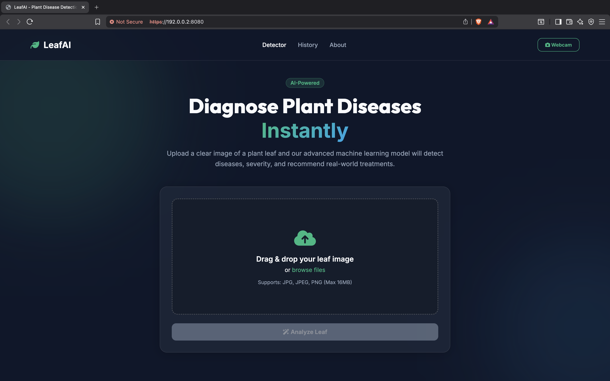

<<<<<<< HEAD
# Plant-Leaf-Disease-Detection
A production-ready agricultural AI platform empowering farmers with instantaneous deep-learning diagnoses and precision treatment plans.
=======
<div align="center">

# 🌿 AgroVision: AI-Powered Plant Disease Diagnostic Platform
<p align="center">
  
  
  
  
  
</p>

*A production-ready agricultural AI platform empowering farmers with instantaneous deep-learning diagnoses and precision treatment plans.*

</div>

---

## 📸 Demo & Preview

<div align="center">
  
</div>

> *Live demonstration of the leaf scanning interface, confidence metrics, and dynamic clinical treatment tabs.*

---

## 🧠 About the Project
**AgroVision** is an industry-grade agricultural technology solution bridging the gap between deep learning and field-level agronomy. 

Crop diseases cause massive yield losses globally, severely impacting smallholder farmers and jeopardizing international food security. Often, misdiagnosis leads to the use of incorrect chemicals, damaging soil viability and surrounding ecosystems. **AgroVision solves this** by allowing anyone with a smartphone or webcam to instantly identify plant pathogens with state-of-the-art accuracy, instantly providing an encyclopedic breakdown of organic and chemical remediation steps.

---

## ✨ Features
- 📷 **Real-Time Image Upload & Webcam Capture:** Seamless drag-and-drop file support alongside native webcam modal integration.
- 🤖 **Deep Learning Inference:** Optimized CNN inference engine identifying specific strains of diseases instantly.
- 💊 **Disease-to-Solution Engine:** Automatically maps the diagnosed illness to specific Treatment, Prevention, and Care Guide modules.
- 📱 **Responsive Glassmorphism UI:** A stunning, mobile-first SaaS interface built for accessibility out in the field.
- 🗄️ **Offline History Dashboard:** Automatically saves your prior agricultural scans and results using secure offline `localStorage`.
- 🔮 **Future-Ready Architecture:** Scalable REST API designed to support future LLM Ag-Bots and expanding multi-crop repositories.

---

## 🏗️ Tech Stack
- **Frontend:** Vanilla JS, HTML5, CSS3 (Glassmorphism & CSS Grid)
- **Backend:** Python, Flask, Flask-Cors
- **Machine Learning:** TensorFlow, Keras, NumPy
- **Server Application:** Gunicorn, Werkzeug

---

## ⚙️ Installation & Setup

Follow these steps to get your local environment running securely:

1. **Clone the Repository**
   ```bash
   git clone https://github.com/muzzo-coder/Plant-Leaf-Disease-Prediction.git
   cd Plant-Leaf-Disease-Prediction
   ```

2. **Create a Virtual Environment**
   ```bash
   python -m venv .venv
   source .venv/bin/activate  # On Windows use: .venv\Scripts\activate
   ```

3. **Install Dependencies**
   ```bash
   pip install -r requirements.txt
   ```

4. **Run the Application**
   ```bash
   python app.py
   ```

5. **Access the Platform**
   Open your browser and navigate strictly to:
   ```text
   http://127.0.0.1:8080/
   ```

---

## 📁 Project Structure
```text
📦 AgroVision-Plant-Disease-Prediction
 ┣ 📂 models/                 # Pretrained Keras models & JSON Knowledge Base
 ┣ 📂 routes/                 # Flask API blueprints & endpoints
 ┣ 📂 services/               # Singleton ML inference logic
 ┣ 📂 static/                 # CSS styling, Javascript SPA logic, and uploads
 ┣ 📂 templates/              # HTML frontend layouts
 ┣ 📂 utils/                  # Validation & error handling helpers
 ┣ 📜 app.py                  # Core Application Factory
 ┣ 📜 gunicorn.conf.py        # Production web server configs
 ┣ 📜 README.md               # Project documentation
 ┣ 📜 Procfile                # PaaS cloud deployment manifest
 ┗ 📜 requirements.txt        # Python library dependencies
```

---

## 🧪 Usage Guide
1. **Upload an Image:** Drag and drop a clear photo of a diseased plant leaf into the dashboard, or click the **Webcam** button to capture a live field photo.
2. **Execute Prediction:** Click **"Predict"** to send the image securely to the Flask API.
3. **Analyze Results:** The app will display the exact disease name, a severity badge, and the AI's probabilistic confidence score.
4. **Take Action:** Navigate through the dynamically generated **Treatment**, **Prevention**, and **Care Guide** tabs to save your crop.

---

## 🧠 Model Details
- **Dataset:** Trained on a heavily curated dataset derived from PlantVillage imagery (High-resolution leaf pathology).
- **Architecture:** Convolutional Neural Network (CNN) configured via Keras/TensorFlow for robust feature extraction.
- **Input Size:** `224x224` RGB images (Automatically scaled and normalized via backend logic).
- **Classes:** Currently optimized for major horticultural leaf pathogens (e.g., Early Blight, Late Blight, Target Spot, Spider Mites, Bacterial Spot).

---

## 🌿 Disease Solution System
The true intelligence of AgroVision extends beyond simple image classification. Upon prediction, the class name queries `disease_kb.json`—a highly structured clinical dictionary. This bypasses generic outputs by explicitly offering safe, verified **Organic Treatments** alongside standard **Chemical Interventions**, ensuring sustainable farming practices are prioritized in the field.

---

## 🚀 Deployment
This application is fully containerized and production-ready.

### Render / Railway
1. Connect your GitHub repository to Render/Railway.
2. Select **Python Environment**.
3. The platform will automatically read the included `Procfile` (`web: gunicorn --config gunicorn.conf.py app:app`).
4. Set Environmental Variable: `PORT = 8000`

### AWS (Elastic Beanstalk / EC2)
1. Use the pre-configured `Dockerfile` (if applicable) or pull the repository to your EC2 instance.
2. Run via standard Gunicorn daemon mapping to port 80, or safely place behind an Nginx reverse proxy.

---

## 🔮 Future Improvements
- [ ] **Mobile Native App:** Wrapping the frontend in React Native or Flutter for offline-first iOS/Android field support.
- [ ] **Real-Time Detection:** Live bounding-box object detection over continuous video feeds in the browser.
- [ ] **Multi-Language Support:** Integrating localization libraries for international farming communities (Hindi, Spanish, French).
- [ ] **Conversational Ag-Bot:** Integrating an LLM to allow farmers to dynamically "chat" about the specific disease prediction and weather conditions.

---

## 🤝 Contributing
Contributions are what make the open-source community such an amazing place to learn, inspire, and create. Any contributions you make are **greatly appreciated**.

1. Fork the Project
2. Create your Feature Branch (`git checkout -b feature/AmazingFeature`)
3. Commit your Changes (`git commit -m 'Add some AmazingFeature'`)
4. Push to the Branch (`git push origin feature/AmazingFeature`)
5. Open a Pull Request

---

## 📜 License
Distributed under the MIT License. See `LICENSE` for more information.

---

## 👨‍💻 Author
**Mujjamil Sofi**  
*Software Engineer & Tech Innovator*  

[](https://github.com/muzzo-coder)
[](https://www.linkedin.com/in/mujjamil-sofi/)
[](mailto:mujammilsofi2@gmail.com)
>>>>>>> 47e8250 (Initial commit)
